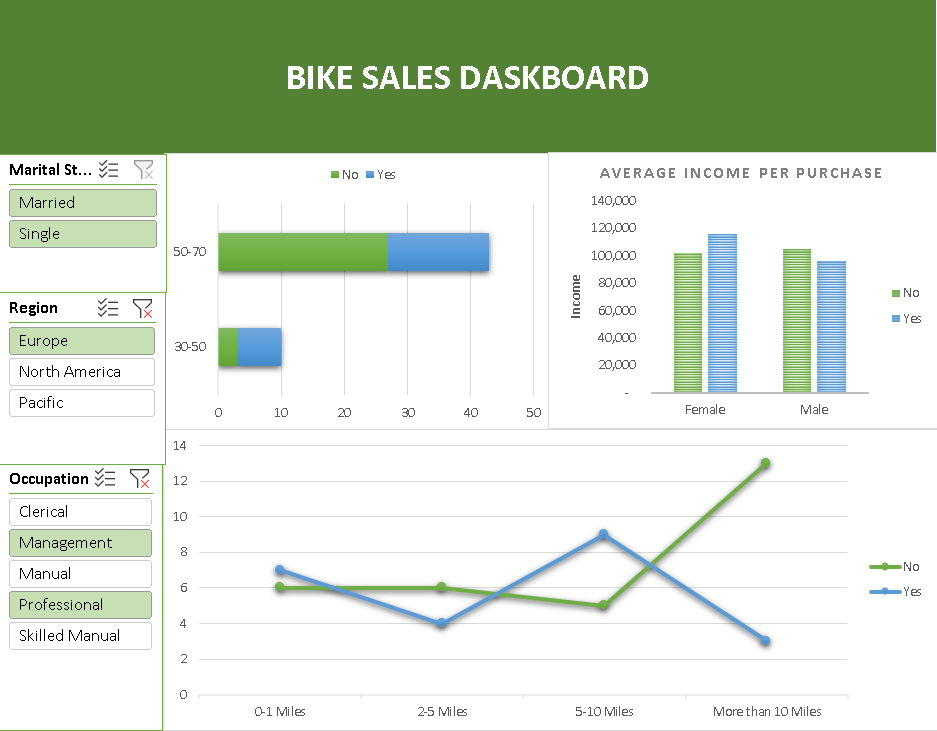
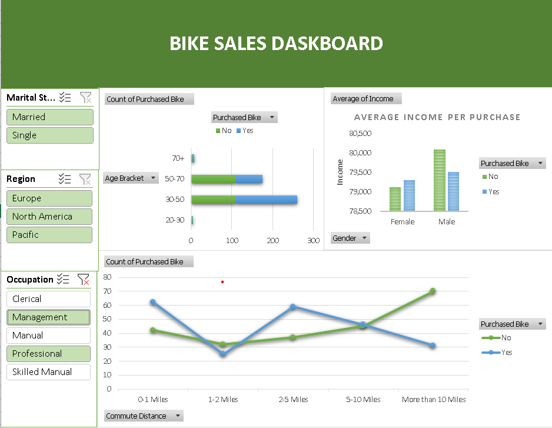

<h1>Bike Sales Data Analysis Project Overview</h1>
<h3>Project Introduction</h3>

In this data analysis project, we explore a dataset that captures information about bike sales among a diverse group of individuals. The dataset encompasses various demographic and socioeconomic factors, providing valuable insights into the factors influencing bike purchase decisions.

<h3>Dataset Features</h3>
<h4>1. Marital Status</h4>

Categorizes individuals into marital status groups such as married and single.

<h4>2. Gender</h4>
Identifies the gender of individuals involved in the dataset.
<h4>3. Income</h4>
Represents the income level of individuals, providing a spectrum of financial backgrounds.
<h4>4. Education</h4>
Describes the educational attainment of individuals, reflecting the diversity of educational backgrounds.
<h4>5. Occupation</h4>
Classifies individuals based on their profession, offering insights into the correlation between occupation and bike purchases.
<h4>6. Number of Cars</h4>
Specifies the number of cars owned by individuals, potentially influencing the decision to purchase a bike.
<h4>7. Region</h4>
Categorizes the dataset based on geographical regions, allowing for regional variations in bike sales analysis.
<h4>8. Age</h4>
Provides the age distribution of individuals in the dataset, offering insights into age-related patterns in bike purchases.
<h4>9. Purchase</h4>
Indicates whether an individual made a bike purchase (Yes) or not (No).

<h3>Project Objectives</h3>

Exploratory Data Analysis (EDA):Conduct a comprehensive EDA to understand the distribution and relationships between variables within the dataset.

Demographic Analysis: Investigate how demographic factors such as marital status, gender, income, education, and occupation correlate with bike purchase decisions.

Socioeconomic Impact: Explore the impact of socioeconomic factors, including income and education, on bike sales.

Geographical Patterns: Examine regional variations to identify if certain areas exhibit higher tendencies for bike purchases.

Age-Related Trends: Analyze age-related patterns to understand if specific age groups are more inclined to buy bikes.

Influence of Car Ownership: Investigate whether the number of cars owned influences the likelihood of purchasing a bike.

Visualization: Create visualizations, such as charts and graphs, to effectively communicate patterns and trends discovered during the analysis.

<h3>Analysis Steps</h3>
<h5>Define Objectives and Questions</h5>
<h5>Understand the Dataset</h5>
<h5>Exploratory Data Analysis (EDA)</h5>
<h5>Data Cleaning and Preprocessing</h5>
<h5>Create Pivot Tables</h5>
<h5>Generate Descriptive Statistics</h5>
<h5>Visualizations</h5>
<h5>Interpret Results</h5>
<h5>Document and Share</h5>

<h3>Pivot Tables</h3>

(images/shot.png)
images/shot.png

<h3>Visualizations</h3>

# Acknowledgments

We would like to express our gratitude to the following individuals and resources that contributed to the success of this Excel-based data analysis project:

- AlexTheAnalyst
- **[Repository]**: https://github.com/AlexTheAnalyst
- **[Online Resource]**: (https://github.com/AlexTheAnalyst/Excel-Tutorial/blob/main/Excel%20Project%20Dataset.xlsx)

Feel free to explore and build upon this work, and we welcome any feedback or contributions from the community.

Thank you!
